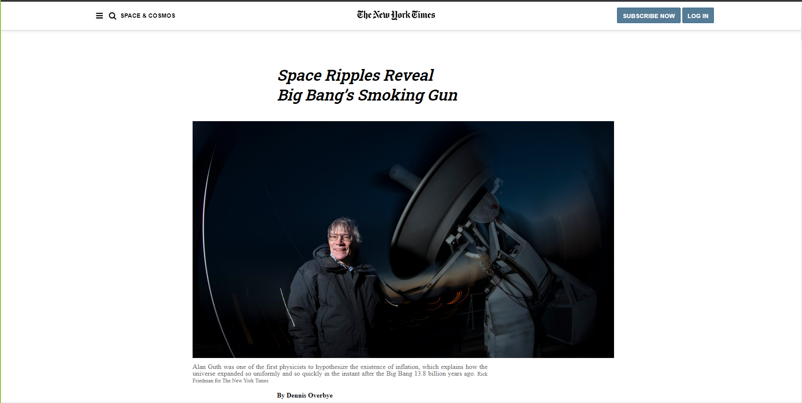

# newyork-times-clone

> The site is a clone of an article page of New York Times Website

The Project uses Flex, Grid and floats

## Built With

- HTML5
- CSS3

## Live Demo

[Live Demo Link](https://rawcdn.githack.com/emasdev/newyork-times-clone/8b585fbb072fe7ab2c06815f821616c9aedc6206/index.html)

## Authors

👤 **Emanuel**

- Github: [@githubhandle](https://github.com/emasdev)

👤 **K**

- Github: [@harshdeepkanhai](https://github.com/harshdeep-kanhai)
- Twitter: [@harshdeepkanhai](https://twitter.com/harshdeepkanhai)
- Linkedin: [linkedin](https://www.linkedin.com/in/harshdeepkanhai/)

## 🤝 Contributing

Contributions, issues and feature requests are welcome!

Feel free to check the [issues page](issues/).

## Show your support

Give a ⭐️ if you like this project!

## Acknowledgments

- Hat tip to anyone whose code was used
- Inspiration
- etc

## 📝 License

This project is [MIT](lic.url) licensed.
